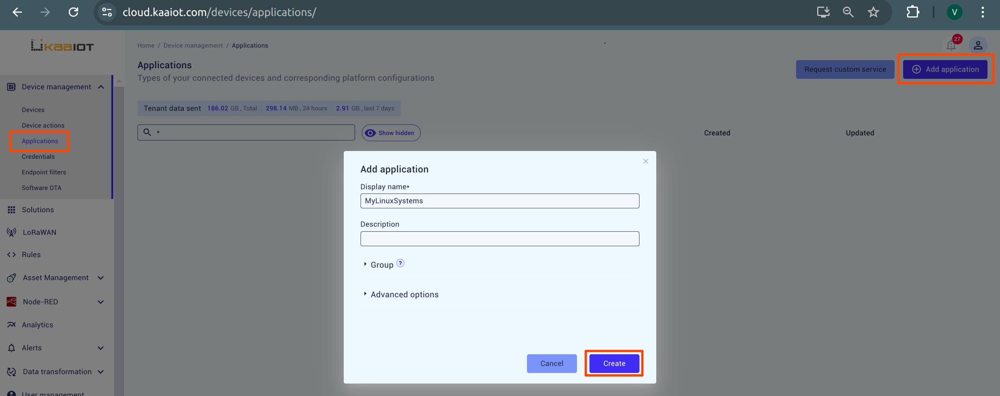
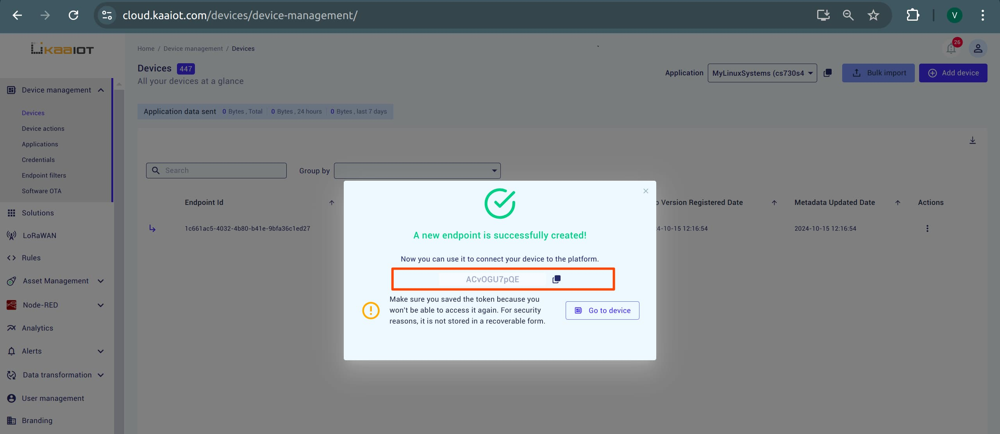

# Simple Client

This example demonstrates how to utilize the `kaa_mqtt_client` library. 


## Install Dependencies

Run the following command to install the required dependencies:

```bash
pip install -r requirements.txt
```


## Environment Variables

Like all other examples, this one requires environment variables to interact with the Kaa API. The most common variables are `DEFAULT_KPC_HOST`, `APPLICATION_VERSION`, and `ENDPOINT_TOKEN`. Here’s how to obtain them.


## Setting Up Environment Variables

To obtain environment variables, we first need to create an **application**. The **application** serves as storage for your devices and provides default settings for each one. From the application, we'll be able to create an **endpoint** that enables you to receive and view the generated data.


### Steps to Create the Endpoint and Retrieve Environment Variables

1. **Open the Kaa Console**: 
   - Navigate to the **Applications** tab.
   - Choose a name for your application and create it.
   

2. **Add a Device**: 
   - In the **Devices** tab, select your application from the dropdown menu.
   - Click **Add Device**, choose a name for the device, and create it.
   

3. **Copy the Token**: 
   - You will be presented with a token. Copy this token, as it is the `ENDPOINT_TOKEN`.
   

4. **Get Application Version**: 
    - Open your newly created device and copy the `appVersion.name`. This will be `APPLICATION_VERSION`.
   

5. **Get Default KPC Host**: 
   On the device page, follow these steps:

   1. Navigate to **Data Publish**.
   2. Check the **MQTT** option.
   3. Copy the resulting URL.

   Next, remove `mqtt://` from the URL. You should end up with something like this: `mqtt.cloud.kaaiot.com`. 

   This value is your `DEFAULT_KPC_HOST`, which is the last variable.


## Provisioning Your Python Script

Here's an example of the credentials you should provide. Replace the placeholder values with your own and copy the result into your terminal:

```bash
export DEFAULT_KPC_HOST="mqtt.cloud.kaaiot.com"
export DEFAULT_KPC_PORT="1883"
export APPLICATION_VERSION="{your-application-version}"
export ENDPOINT_TOKEN="{your-endpoint-token}"
```


## Run the simple_client Script

This is the minimum setup required to run the `simple_client` example. Follow these steps:

1. Navigate to the `examples/simple_client` directory.
2. Install its dependencies by running:
  ```bash
  pip install -r requirements.txt
  ```
3. Execute the script with:
  ```
  python3 main.py
  ```
  
This should provide you with a sufficient example to build upon.